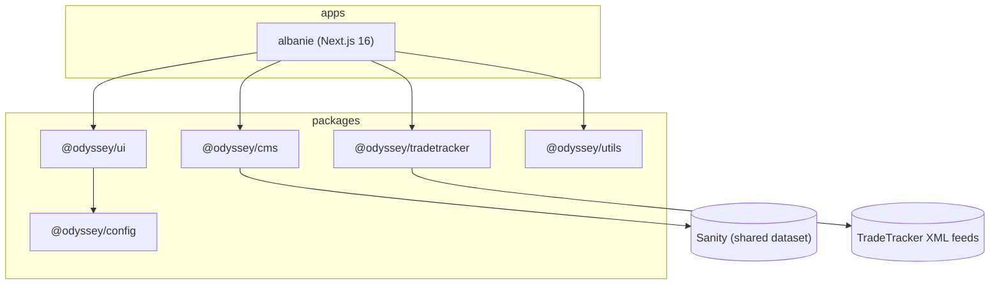

# Architecture

## Overview

Odyssey is a Turborepo monorepo. Apps are thin; shared capability lives in packages.

## Packages

| Package                 | Responsibility                                                                       |
| ----------------------- | ------------------------------------------------------------------------------------ |
| `@odyssey/ui`           | Shared React components, Tailwind v4 theme and design tokens (shadcn/ui compatible). |
| `@odyssey/cms`          | Sanity client, GROQ helpers, schema definitions, the `market` convention.            |
| `@odyssey/tradetracker` | Fetch, parse and normalize TradeTracker XML product feeds.                           |
| `@odyssey/utils`        | Framework-agnostic helpers (formatting, slugs, ...).                                 |
| `@odyssey/config`       | Shared `tsconfig` and ESLint flat configs.                                           |

## Multi-market strategy

- A **single Sanity project/dataset** stores content for all markets. Every market-scoped
  document carries a `market` field (`@odyssey/cms` → `marketField`), and every content query
  filters on it (`fetchByMarket`). This keeps schemas and content tooling shared.
- Each **app** targets exactly one market and can override the design system's **semantic**
  tokens for its own brand, while reusing all primitives and components.

## Content & data flow

- **Editorial content** is authored in Sanity and rendered by apps via server components with
  caching/ISR.
- **Affiliate offers** come from TradeTracker XML feeds. Phase A (current): apps fetch and
  normalize feeds server-side with Next.js `fetch` caching / ISR — **no database**.
  Phase B (future, tracked in Linear): a scheduled job syncs feeds into a database
  (Prisma/Postgres) to enable richer search, filtering and stable listing pages.

## Rendering & performance

- App Router + React Server Components by default; client components only where interactivity
  requires it.
- Static generation + ISR for content and offer pages; revalidation windows configured per
  data source.

## Environments & hosting

- Hosted on **Vercel**. Each app is a Vercel project with its own env vars (Sanity
  project/dataset, TradeTracker feed URLs, site URL). See each app's `.env.example`.
